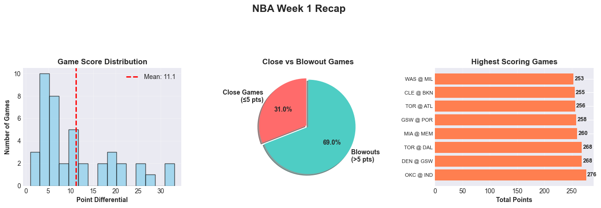
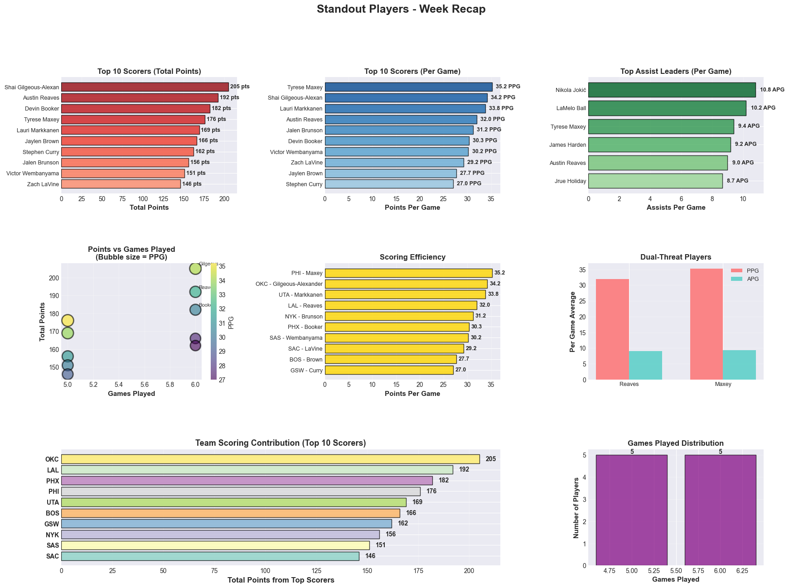
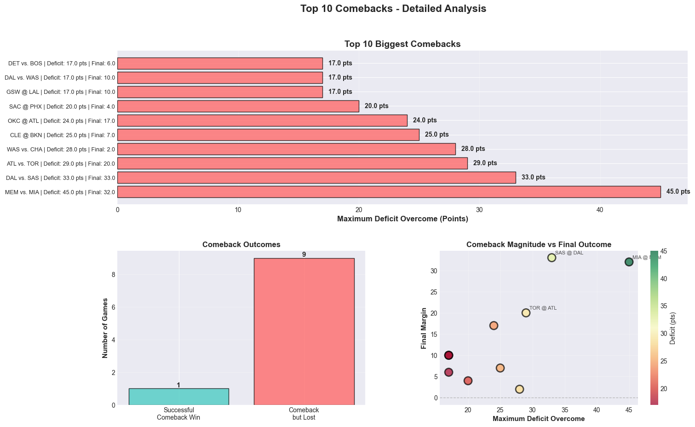

# NBA Week 1 Recap - Analysis Summary

## Executive Summary

This analysis provides a comprehensive overview of NBA games played during Week 1 (October 20-26, 2025), covering game outcomes, standout player performances, and the most dramatic comebacks of the week.

---

## 1. Overall Game Performance

### Key Findings:

**Game Score Distribution:**
- Average point differential: **11.1 points**
- The highest concentration of games (10 games) had point differentials between 0-5 points, indicating a significant number of competitive contests
- Distribution shows a clear right-skewed pattern, with fewer blowouts than close games at the lower end

**Game Competitiveness:**
- **Close Games (≤5 pts): 31.0%** - Nearly one-third of games were decided by 5 points or fewer
- **Blowouts (>5 pts): 69.0%** - The majority of games were more decisive
- This suggests that while many games were competitive, most ended with a clear winner

**Highest Scoring Games:**
- Top scoring game: **OKC @ IND** with **276 total points**
- Three games exceeded 268 total points: DEN @ GSW (268), TOR @ DAL (268), and OKC @ IND (276)
- Average high-scoring games ranged from 253-276 points, showing strong offensive performances across the league

---

## 2. Standout Player Performances

### Top Performers:

**Leading Scorers:**
- **Shai Gilgeous-Alexander (OKC)**: 205 total points in 6 games, averaging **34.2 PPG**
  - Led the league in total points for the week
  - Consistent high-level scoring across all games
  
- **Tyrese Maxey (PHI)**: **35.2 PPG** (highest per-game average)
  - Despite playing only 5 games, showed exceptional scoring efficiency
  - Also ranked among top assist leaders (9.4 APG), demonstrating dual-threat capability

- **Austin Reaves (LAL)**: 192 points in 6 games, **32.0 PPG**
  - Ranked #2 in total points
  - Top assist leader with 54 total assists (9.0 APG), showing exceptional playmaking

**Key Statistical Highlights:**
- Average PPG among top 10 scorers: **31.1 PPG**
- Average games played: **5.5 games**
- **Dual-Threat Players**: Austin Reaves and Tyrese Maxey excelled in both scoring and assisting
  - Maxey: 35.2 PPG, 9.4 APG
  - Reaves: 32.0 PPG, 9.0 APG

**Assist Leaders:**
- **Nikola Jokić (DEN)**: 10.8 APG (highest assist average)
- **LaMelo Ball (CHA)**: 10.2 APG
- Multiple players averaged 8.7+ APG, indicating strong ball movement across the league

**Team Contributions:**
- OKC, LAL, and PHX led in scoring contributions from their top players
- Distribution shows diverse team representation in top performers

---

## 3. Comeback Analysis

### Most Dramatic Comebacks:

**Biggest Comeback:**
- **MEM vs. MIA**: Overcame a **45-point deficit** - the largest comeback of the week
  - Despite the massive comeback effort, finished with a 32-point final margin
  - This represents one of the most remarkable in-game turnarounds

**Top 5 Comebacks:**
1. **MEM vs. MIA**: 45-point deficit overcome
2. **DAL vs. SAS**: 33-point deficit overcome (final margin: 33 pts)
3. **ATL vs. TOR**: 29-point deficit overcome (final margin: 20 pts)
4. **WAS vs. CHA**: 28-point deficit overcome (final margin: 2 pts) - most successful comeback
5. **CLE @ BKN**: 25-point deficit overcome (final margin: 7 pts)

**Key Observations:**
- **Only 1 out of 10 top comebacks resulted in a victory** for the team making the comeback
- This suggests that while teams were able to mount significant rallies, they often fell short of complete comebacks
- The relationship between comeback magnitude and final outcome shows that larger deficits, even when overcome, often still resulted in losses
- Close games (≤5 pts) provided more opportunities for successful comebacks

**Comeback Success Rate:**
- **Successful Comeback Wins: 1 game (10%)**
- **Comeback but Lost: 9 games (90%)**
- This pattern indicates that while dramatic rallies occurred, the teams making comebacks often couldn't sustain momentum to secure victories

---

## 4. Key Insights

### Competitive Balance:
- 31% of games were decided by 5 points or fewer, showing good competitive balance
- Mean point differential of 11.1 points suggests moderate game competitiveness overall

### Offensive Explosiveness:
- Multiple games exceeded 250+ total points
- Top scorers averaged over 31 PPG, indicating strong individual offensive performances
- League-wide scoring appears high, with multiple teams capable of explosive offensive nights

### Resilience and Momentum:
- The week featured several remarkable comebacks, including one 45-point rally
- However, comeback success rate was low (10%), suggesting teams need to maintain momentum throughout games rather than relying on late rallies

### Player Excellence:
- Multiple players demonstrated elite dual-threat capabilities (scoring + playmaking)
- Top performers showed consistency across multiple games
- Balanced distribution of top performers across different teams

---

*Analysis Period: October 20-26, 2025*  
*Data Source: NBA API via nba_api Python package*
