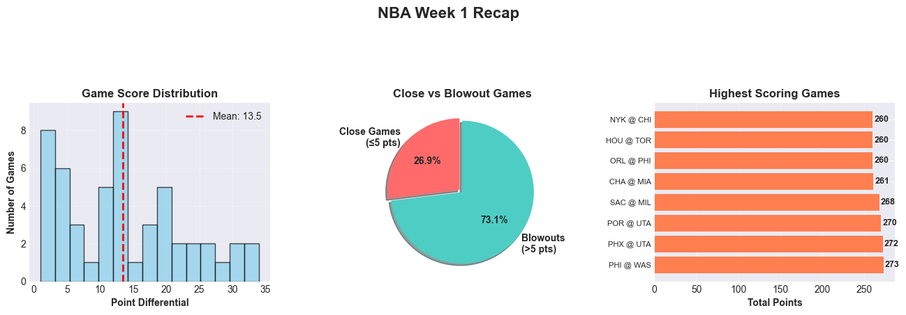
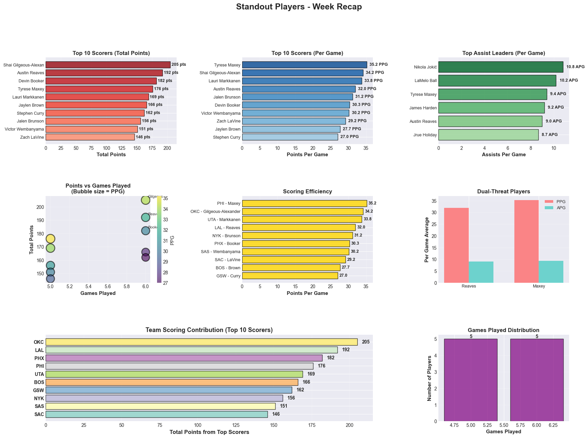
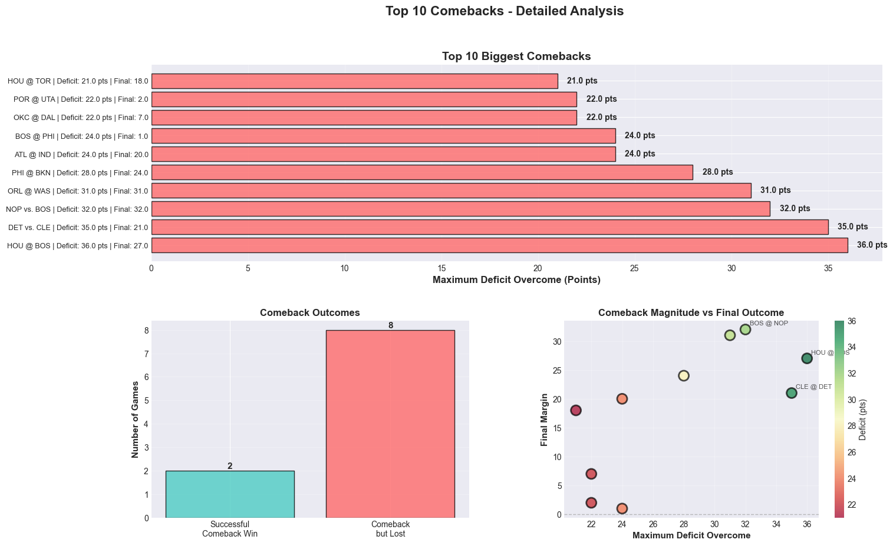

## NBA Week 2 Recap - Analysis Summary

## Executive Summary

This analysis provides a concise overview of NBA games played during Week 2 (October 27 – November 2, 2025), covering game outcomes, standout player performances, and the most dramatic comebacks of the week.

---

## 1. Overall Game Performance

### Key Findings:

- **Total Games:** **52**
- **Close Games (≤5 pts):** **14**
- **Game Score Distribution:** Point differentials illustrate the balance between close contests and decisive wins (vertical red line marks the mean differential in the histogram).
- **Game Competitiveness:** The close-vs-blowout split highlights how frequently games were decided by ≤5 points versus larger margins.
- **Highest-Scoring Games:** The top matchups by total points showcase the week’s most offense-heavy performances.

---

## 2. Standout Player Performances

### Top Performers:

- **Leading Scorers:** Leaders in total and per-game points drove team offenses throughout the week.
- **Assist Leaders & Dual-Threat Players:** Several players paired high scoring with elite playmaking.
- **Efficiency:** Scoring efficiency views link volume with per-game production.
- **Team Contributions:** Which teams relied most on their top scorers is summarized in the team contribution panel.

#### Summary Stats (Top 10 Scorers)

- **Average Total Points (Top 10):** **170.5**
- **Average PPG (Top 10):** **31.1**

---

## 3. Comeback Analysis

### Most Dramatic Comebacks:

- **Top 10 Biggest Comebacks:** Ranked by maximum deficit overcome, based on play-by-play scoring margins.
- **Outcome Split:** How often large rallies turned into wins compared with rallies that fell short.
- **Magnitude vs. Final Outcome:** A scatter view connecting comeback size to the final margin.

---

## 4. Key Insights

- **Competitive Balance:** A meaningful share of games were close, indicating strong parity across matchups.
- **Offensive Explosiveness:** Multiple high-scoring games point to elevated offensive efficiency and pace.
- **Resilience & Momentum:** Big in-game swings were common; converting rallies into wins remained challenging.
- **Player Excellence:** Multiple stars delivered consistent, high-impact weeks across scoring and playmaking.

---

*Analysis Period: October 27 – November 2, 2025*  
*Data Source: NBA API via nba_api (players/teams logs, league gamelog, play-by-play)*

