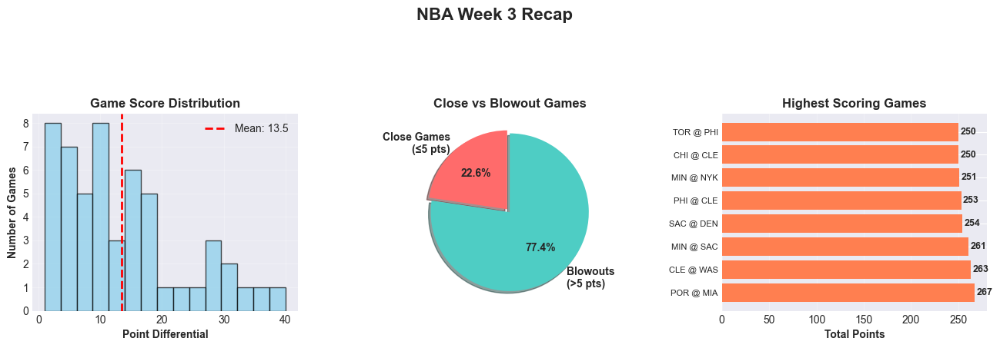
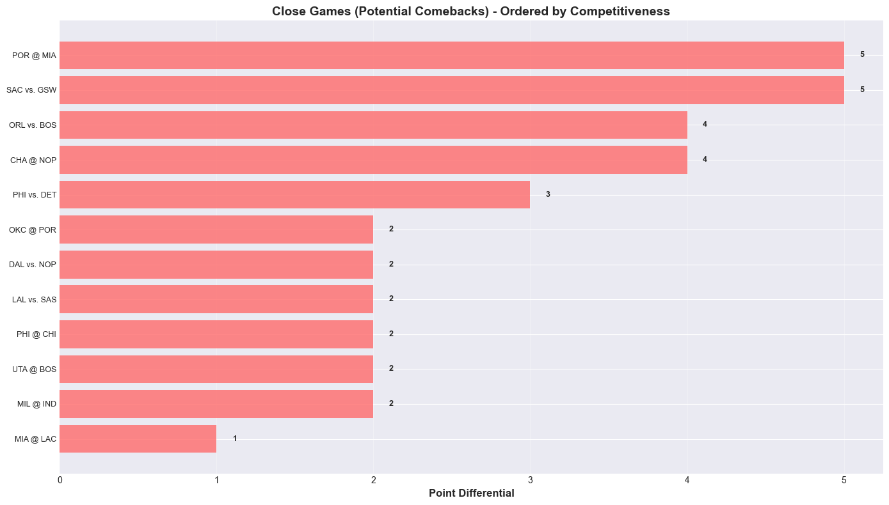

## NBA Week 3 Recap - Analysis Summary

---

## 1. Overall Game Performance

### Key Findings:

- **Total Games:** **53**
- **Close Games (≤5 pts):** **12** (≈22.6% of all games)
- **Game Score Distribution:** Mean point differential landed at **13.5 points** (red dashed line on the histogram).
- **Game Competitiveness:** Close/blowout split shown in the pie chart (≈22.6% close vs. 77.4% blowout).
- **Highest-Scoring Games:** POR @ MIA (267 pts), CLE @ WAS (263 pts), MIN @ SAC (261 pts), SAC @ DEN (254 pts), PHI @ CLE (253 pts), MIN @ NYK (251 pts), CHI @ CLE (250 pts), TOR @ PHI (250 pts).

---

## 2. Standout Player Performances

### Top Performers:

- **Leading Scorers:** Shai Gilgeous-Alexander (365 pts in 11 GP) paced the league, followed by Giannis Antetokounmpo (334 in 10) and Tyrese Maxey (332 in 10); Devin Booker (312), Jaylen Brown (308) and Donovan Mitchell (304) also cleared 300.
- **Assist Leaders & Dual-Threat Players:** Cade Cunningham (109 AST), Nikola Jokić (107) and Davion Mitchell (84) topped the playmaking chart, with Maxey and Harden combining heavy usage with 80+ assists.
- **Efficiency:** Maxey’s **35.2 PPG** led the bubble plot, with SGA (33.2 PPG) and Lauri Markkanen (27.6 PPG) anchoring efficient high-volume scoring.
- **Team Contributions:** OKC (205 total points from top scorers), LAL (192) and PHX (176) leaned most on their primary options, highlighting star-driven offenses.

#### Summary Stats (Top 10 Scorers)

- **Average Total Points:** **307.2**
- **Average PPG:** **30.4**

---

## 3. Comeback Analysis

### Most Dramatic Comebacks:

- **Tightest Finishes:** POR @ MIA and SAC vs. GSW were decided by only **5 points**, with ORL vs. BOS and CHA @ NOP close behind at **4**.
- **Other Nail-Biters:** PHI vs. DET flipped late by 3, while OKC @ POR, DAL vs. NOP, LAL vs. SAS and PHI @ CHI all ended within 2 points.
- **One-Possession Thriller:** MIA @ LAC was the week’s lone 1-point final.

---

## 4. Key Insights

- **Competitive Balance:** Nearly a quarter of contests went down to the final possession window, yet the average margin remained 13.5 points.
- **Offensive Trends:** Eight games eclipsed the 250-point mark, highlighted by POR @ MIA’s shootout (267 total points).
- **Resilience & Momentum:** Multiple teams erased deficits of four or fewer in crunch time, underscoring late-game volatility.
- **Player Excellence:** SGA and Giannis are setting the early scoring pace, Cunningham balanced 302 points with a week-best 109 assists, and Jalen Duren dominated the glass (132 rebounds).

---

*Analysis Period: November 3 – November 9, 2025*  
*Data Source: NBA API via nba_api (players/teams logs, league gamelog, play-by-play)*

